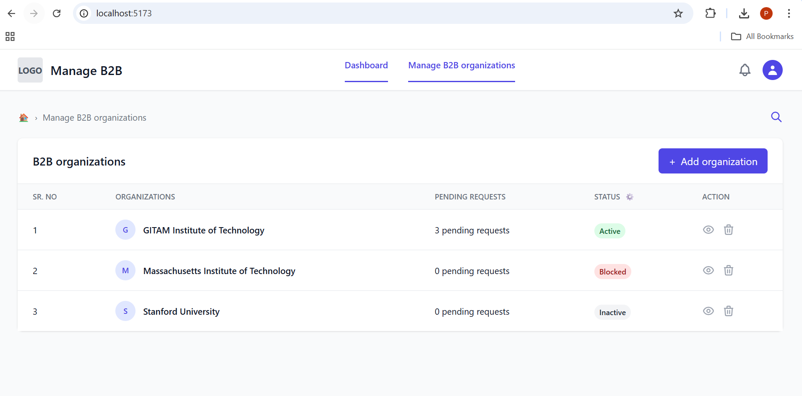
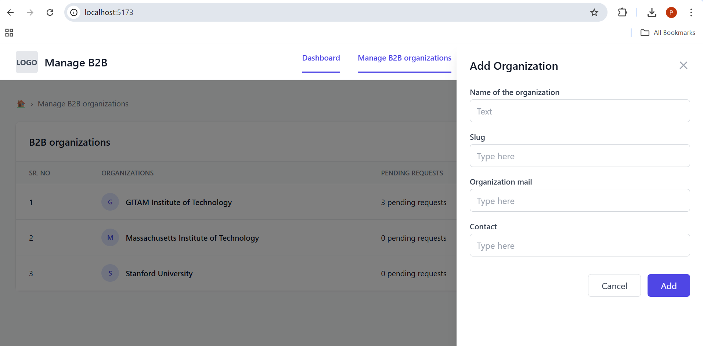
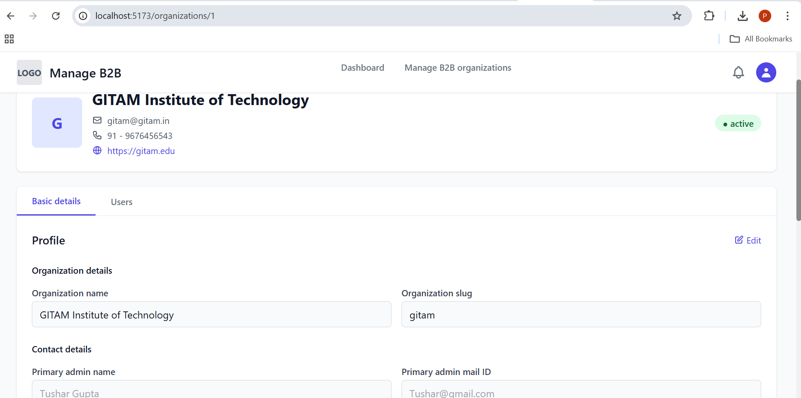
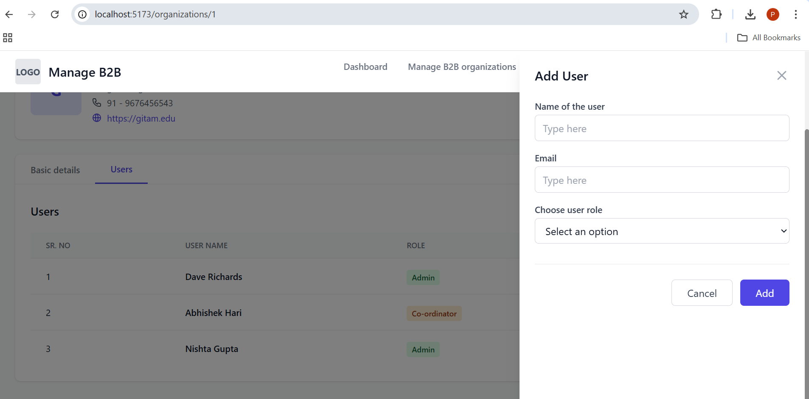

# Organization & Users Management 

A full-stack web application for managing B2B organizations and their users, built with React, Node.js, Express, and PostgreSQL.

## 📋 Table of Contents
- [Features](#features)
- [Tech Stack](#tech-stack)
- [Project Structure](#project-structure)
- [Prerequisites](#prerequisites)
- [Installation](#installation)
- [Database Setup](#database-setup)
- [Running the Application](#running-the-application)
- [API Endpoints](#api-endpoints)
- [Screenshots](#screenshots)
- [ER Diagram](#er-diagram)

## ✨ Features

### Organizations Management
- View all B2B organizations in a responsive table
- Add new organizations with essential details (name, slug, email, contact)
- Edit organization details including contact information and settings
- Delete organizations with cascade delete for associated users
- View organization status (Active, Blocked, Inactive)
- Track pending requests per organization

### Users Management
- View users within each organization
- Add users with roles (Admin or Co-ordinator)
- Role-based user management
- Edit and delete users
- User role badges for easy identification

### User Interface
- Clean, modern design with Tailwind CSS
- Side panel modals for adding organizations and users
- Responsive layout for all screen sizes
- Intuitive navigation and breadcrumbs
- Real-time data updates

## 🛠️ Tech Stack

### Frontend
- **React 18** - UI library
- **Vite** - Build tool and dev server
- **React Router DOM** - Client-side routing
- **Axios** - HTTP client
- **Tailwind CSS** - Utility-first CSS framework

### Backend
- **Node.js** - JavaScript runtime
- **Express.js** - Web application framework
- **Sequelize** - ORM for PostgreSQL
- **PostgreSQL** - Relational database
- **CORS** - Cross-origin resource sharing

## 📁 Project Structure

Organization & Users Management/
├── backend/
│ ├── config/
│ │ └── database.js # Database connection
│ ├── controllers/
│ │ ├── organizationController.js
│ │ └── userController.js
│ ├── models/
│ │ ├── Organization.js
│ │ └── User.js
│ ├── routes/
│ │ ├── organizationRoutes.js
│ │ └── userRoutes.js
│ ├── .env # Environment variables
│ ├── server.js # Entry point
│ └── package.json
│
├── frontend/
│ ├── src/
│ │ ├── api/
│ │ │ └── axios.js # API configuration
│ │ ├── components/
│ │ │ └── Header.jsx # Header component
│ │ ├── pages/
│ │ │ ├── OrganizationsPage.jsx
│ │ │ └── OrganizationDetailsPage.jsx
│ │ ├── App.jsx
│ │ ├── main.jsx
│ │ └── index.css
│ ├── package.json
│ └── vite.config.js
│
├── database/
│ └── schema.sql # Database schema
│
├── docs/
│ └── ER Diagram.pdf # Entity Relationship Diagram
│
└── README.md

## 📋 Prerequisites

- **Node.js** (v16 or higher)
- **PostgreSQL** (v12 or higher)
- **npm** or **yarn**
- **Git**

## 🔧 Installation

### 1. Clone the Repository
git clone https://github.com/priya123250/Organization & Users management (Full Stack).git
cd "Organization & Users Management"

text

### 2. Install Backend Dependencies
cd backend
npm install

text

### 3. Install Frontend Dependencies
cd ../frontend
npm install

text

## 🗄️ Database Setup

### 1. Create Database
CREATE DATABASE b2b_management;

text

### 2. Run Schema
Using psql
psql -U postgres -d b2b_management -f database/schema.sql

OR using pgAdmin
Open pgAdmin → Select b2b_management database → Open Query Tool
Paste contents of database/schema.sql and execute
text

### 3. Configure Environment Variables

Create `backend/.env`:
DB_HOST=localhost
DB_PORT=5432
DB_NAME=b2b_management
DB_USER=postgres
DB_PASSWORD=your_password
PORT=5000

text

## 🚀 Running the Application

### 1. Start Backend Server
cd backend
npm run dev

Server runs on http://localhost:5000
text

### 2. Start Frontend Dev Server
cd frontend
npm run dev

Application runs on http://localhost:5173
text

## 📡 API Endpoints

### Organizations

| Method | Endpoint | Description |
|--------|----------|-------------|
| GET | `/api/organizations` | Get all organizations |
| GET | `/api/organizations/:id` | Get organization by ID with users |
| POST | `/api/organizations` | Create new organization |
| PUT | `/api/organizations/:id` | Update organization |
| PATCH | `/api/organizations/:id/status` | Update organization status |
| DELETE | `/api/organizations/:id` | Delete organization |

### Users

| Method | Endpoint | Description |
|--------|----------|-------------|
| GET | `/api/users/organization/:orgId` | Get users by organization |
| POST | `/api/users` | Create new user |
| PUT | `/api/users/:id` | Update user |
| DELETE | `/api/users/:id` | Delete user |

## 📸 Screenshots

### Organizations Dashboard

### Add Organization

### Organization Details

### Add User

## 🗂️ ER Diagram

The database consists of two main entities with a one-to-many relationship:

- **Organizations** (1) → (N) **Users**
- Each organization can have multiple users
- Each user belongs to one organization
- Foreign key: `users.organization_id` references `organizations.id`

View the complete ER Diagram: [docs/ER Diagram.pdf](docs/ER Diagram.pdf)

## 🎯 Key Features Implemented

1. **CRUD Operations** - Full Create, Read, Update, Delete functionality
2. **Relational Data** - Proper foreign key relationships with cascade delete
3. **Input Validation** - Server-side validation for all inputs
4. **Error Handling** - Comprehensive error handling on both frontend and backend
5. **Responsive Design** - Mobile-friendly UI with Tailwind CSS
6. **Side Panel Modals** - Modern UI patterns for adding/editing data
7. **Status Management** - Organization status tracking (Active, Blocked, Inactive)
8. **Role-Based Users** - Admin and Co-ordinator user roles

## 👤 Author

**Gunaparthi Priya Durga**
- GitHub: [@priya123250](https://github.com/priya123250)
- Date: October 2025

## 📝 License

This project is created as part of a technical assessment for a Full Stack Developer position.

---

**Built with ❤️ using React, Node.js, and PostgreSQL**